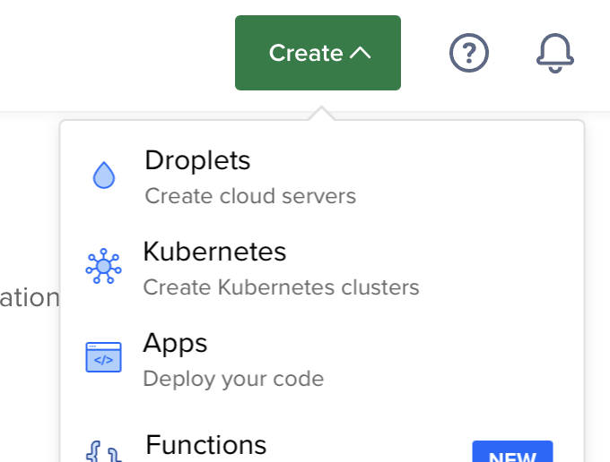
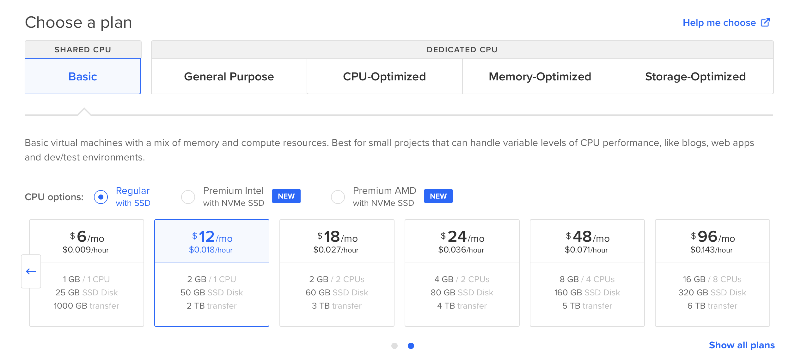
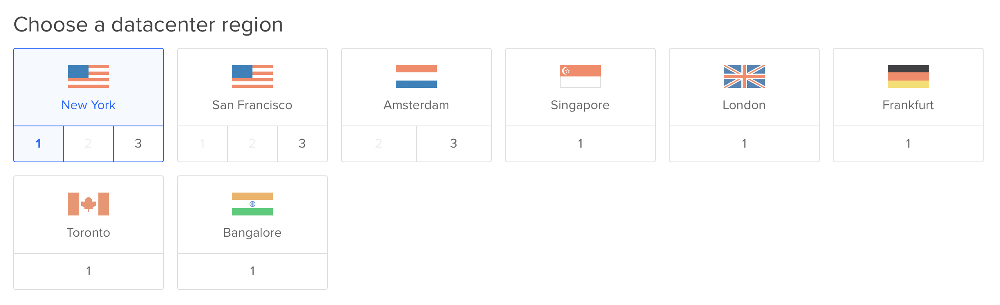
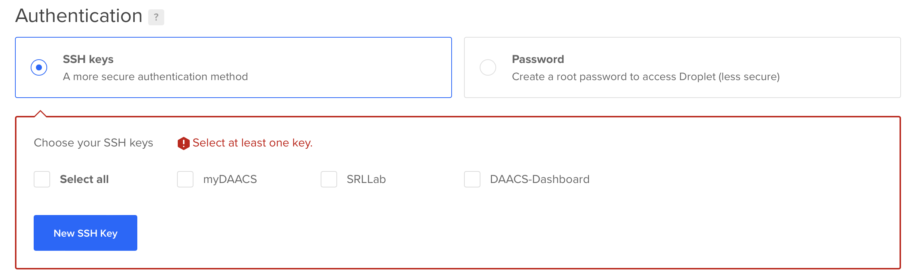
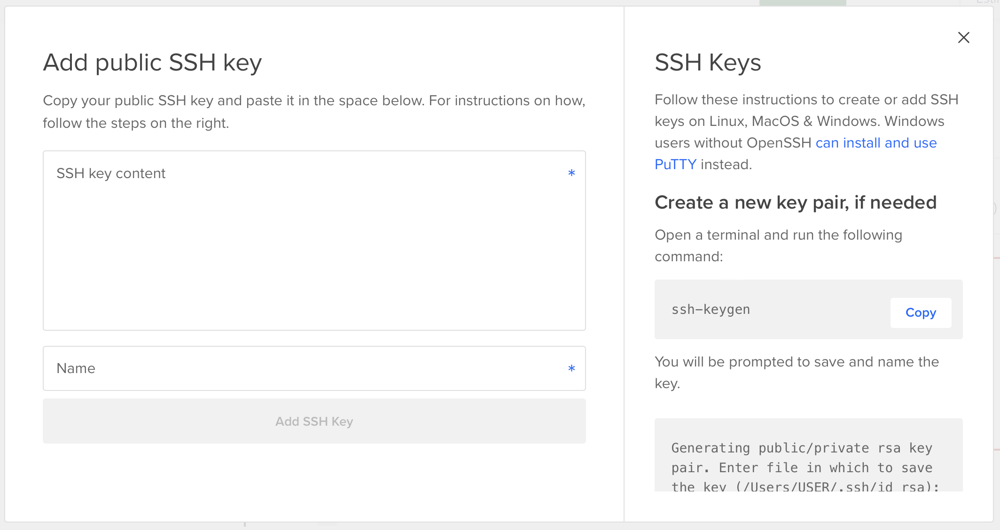

# DAACS Installation Instructions

System requirements:

-   Ubuntu 18.04

## Creating a DigitalOcean Server (Droplet)

This section will show how to setup a server on [DigitalOcean](https://digitalocean.com). If you are using another service (Amazon AWS, personal server, etc.), you can skip to the next section.

Click Create -\> Droplets

<center></center>

For the image, choose Ubuntu version 18.04 (LTS) x64

<center></center>

Choose the server size. We recommend starting smaller as you can always increase the server size but you cannot reduce the server size if the storage size is smaller. That is, if you create a server with 60GB storage, you can not go to a server with less than 60GB. When you increase server sizes you will have the option to not increase the disk size. This is recommended so you can always reduce the size later, unless of course you need more storage. DAACS does not require a lot of disk storage to save student results.

<center></center>

Choose a data center location. Typically pick a data center closest to where the majority of users will be. For institutions operationg in the United States [FERPA](https://www2.ed.gov/policy/gen/guid/fpco/ferpa/index.html) requires you to keep student data on servers within the United States.

<center></center>

Generate a SSH key (note that you can use only a password but this is not recommended).

<center></center>

<center></center>

Select other options. 

* Backups are relatively inexpensive and recommended, but not free.
* The monitoring option is free and will allow you to monitor server resource use from the DigitalOcean dashboard.

Choose a hostname, typically something that is meaningful.

Click create droplet. This will start the server.

------------------------------------------------------------------------

## Installing DAACS

Login to the Ubuntu server. Here, change `SSH_KEY` to the file created above and `XXX.XXX.XXX.XXX` to the IP address of your server.

```
ssh -i ssl/SSH_KEY root@XXX.XXX.XXX.XXX
```

```{bash, eval=FALSE}
mkdir /daacs
cd /daacs
git clone https://github.com/DAACS/DAACS-Setup.git .
```

Install python (*note: this should be added to the installation scripts*)

```{bash, eval=FALSE}
apt install python
```

Edit [`daacs.properties`](start/daacs.properties).

```{bash, eval=FALSE}
vi /daacs//start/daacs.properties
```

You can change the password for MongoDB in [`start/daacs.properties`](start/daacs.properties) and [`install/mongo-user.script.js`](install/mongo-user.script.js). However, we recommend blocking access to the MongoDB to all IP addresses.

Start the installation process.

```{bash, eval=FALSE}
cd /daacs/install/
./install-daacs-all.sh
```

To whitelist a hostname for the web component, update the environment.js file and add the IP address and domain to the `hostWhitelist` parameter at `/usr/local/daacs/DAACS-Web/daacs/config/environment.js` then restart DAACS-Web.

```{bash, eval=FALSE}
vi /usr/local/daacs/DAACS-Web/daacs/config/environment.js
```

```
...
hostWhitelist: [
    /^wwwc-wgu-daacs.gavant.com$/,
    /^web-app$/,
    /^wwwc-excelsior-daacs.gavant.com$/,
    /^wwwd-daacs.gavant.com:\d+$/,
    /^localhost:\d+$/,
    /^159.89.233.238:\d+/
],
...
```

Start the API:

```{bash, eval=FALSE}
cd /daacs/start/
./run-daacs-api.sh
```

If the API starts successfully, you should be able to go to http://X.X.X.X:8080/swagger-ui.html and see the API documentation.

Start the web interface:

```{bash, eval=FALSE}
cd /daacs/start/
./run-daacs-web.sh
```

