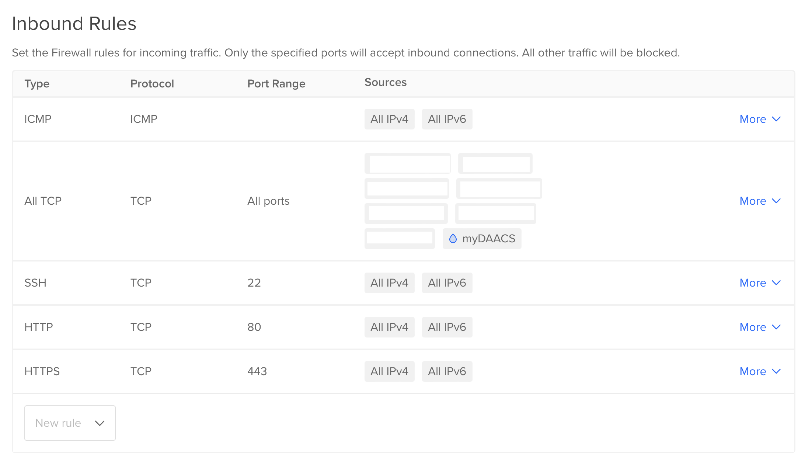
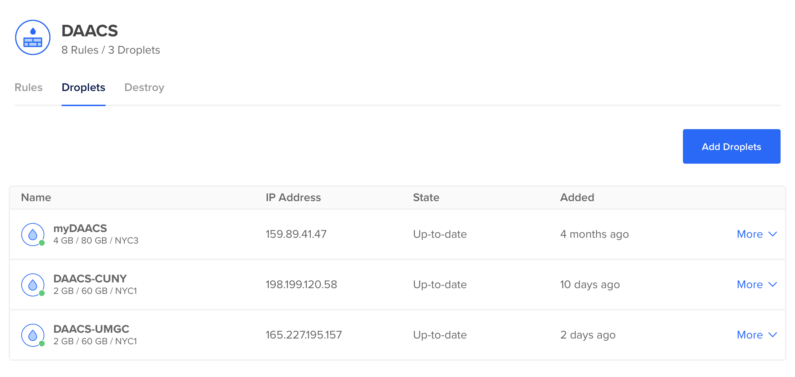

# DAACS Installation Instructions

System requirements:

-   Ubuntu 18.04

## Creating a DigitalOcean Server (Droplet)

This section will show how to setup a server on [DigitalOcean](https://digitalocean.com). If you are using another service (Amazon AWS, personal server, etc.), you can [skip to the next section](#installing-daacs).

Click Create -\> Droplets

<center></center>

For the image, choose Ubuntu version 18.04 (LTS) x64

<center></center>

Choose the server size. We recommend starting smaller as you can always increase the server size but you cannot reduce the server size if the storage size is smaller. That is, if you create a server with 60GB storage, you can not go to a server with less than 60GB. When you increase server sizes you will have the option to not increase the disk size. This is recommended so you can always reduce the size later, unless of course you need more storage. DAACS does not require a lot of disk storage to save student results.

<center></center>

Choose a data center location. Typically pick a data center closest to where the majority of users will be. For institutions operationg in the United States [FERPA](https://www2.ed.gov/policy/gen/guid/fpco/ferpa/index.html) requires you to keep student data on servers within the United States.

<center></center>

Generate a SSH key (note that you can use only a password but this is not recommended).

<center></center>

<center></center>

Select other options. 

* Backups are relatively inexpensive and recommended, but not free.
* The monitoring option is free and will allow you to monitor server resource use from the DigitalOcean dashboard.

Choose a hostname, typically something that is meaningful.

Click create droplet. This will start the server.

------------------------------------------------------------------------

*For the remainder of this document we will use `IP_ADDRESS` and `DAACS_DOMAIN` to correspond to your server's IP address and domain, respectively.*

## Installing DAACS

Login to the Ubuntu server. Here, change `SSH_KEY` to the file created above and `IP_ADDRESS` to the IP address of your server.

```
ssh -i ssl/SSH_KEY root@IP_ADDRESS
```

```{bash, eval=FALSE}
mkdir /daacs
cd /daacs
git clone https://github.com/DAACS/DAACS-Setup.git .
```

Git should be already installed, if not you can install it using `sudo apt-get install -y git`.

Edit [`daacs.properties`](start/daacs.properties).

```{bash, eval=FALSE}
vi /daacs/config/daacs.properties
```

You can change the password for MongoDB in [`start/daacs.properties`](start/daacs.properties) and [`install/mongo-user.script.js`](install/mongo-user.script.js). However, we recommend blocking access to the MongoDB to all IP addresses.

Edit [`environment.js`](config/environment.js)

To whitelist a hostname for the web component, update the environment.js file and add the IP address and domain to the `hostWhitelist` parameter at `/daacs/config/environment.js` then restart DAACS-Web.

Should look like this (change the IP address and domain as appropriate):

```
hostWhitelist: [/^165.227.195.157:\d+$/,/^umgc\.daacs\.net:\d+$/,/^umgc\.daacs\.net$/,/^localhost:\d+$/],
```

Also change:

```
ENV.RESTAPI = "https://DAACS_DOMAIN/api";
```

```{bash, eval=FALSE}
vi /daacs/config/daacs.properties
```

Start the installation process.

```{bash, eval=FALSE}
cd /daacs/install/
./install-daacs-all.sh
```

**Note that any changes to `environment.js` will require you to rebuild the DAACS-Web:**

```
cd /daacs/install
./install-daacs-web.sh
```

Start the API:

```{bash, eval=FALSE}
cd /daacs/start/
./run-daacs-api.sh
```

If the API starts successfully, you should be able to go to http://X.X.X.X:8080/swagger-ui.html and see the API documentation.

Start the web interface:

```{bash, eval=FALSE}
cd /daacs/start/
./run-daacs-web.sh
```


## Installing Web Server

We will use [nginx](https://nginx.org) webserver to handle secure (i.e. https) connections. It will handle all incoming requestsn and redirect them to the two DAACS servers (API and web).

```{bash, eval=FALSE}
sudo apt-get -y install nginx
sudo ufw allow 'Nginx Full'
systemctl status nginx
```

Install letsencrypt to create https certificate. Change the domain as appropriate (note that nginx should not be running while creating the certificate).

```{bash, eval=FALSE}
sudo systemctl stop nginx
sudo apt-get -y install letsencrypt
letsencrypt certonly --standalone -d DAACS_DOMAIN
```

Edit the nginx configuration file.

```{bash, eval=FALSE}
vi /daacs/config/nginx.conf
```

Copy the configuration file to nginx installation directory.

```{bash, eval=FALSE}
sudo cp /daacs/config/nginx.conf /etc/nginx/nginx.conf
```

Start nginx.

```{bash, eval=FALSE}
sudo systemctl start nginx
```

If all is working, then going to https://DAACS_DOMAIN/api/swagger-ui.html will return the API documentation and https://DAACS_DOMAIN will render the DAACS homepage.

## Firewall

You will want to create a firewall the rejects all connections except through ports 80 (for http which will be redirected by ngix) and 443 (for https). You can also allow port 22 to allow ssh connections (i.e. to manage the server). Although that can be limited to specific IP addresses. The black boxes are the IP addresses of computers that are allowed (i.e. whitelisted) to connect to the server on any port. This is used to retrieve data directly from the mongo database.

<center></center>

Once a firewall rule is created, you can apply it to any droplets in your account.

<center></center>

## Theming

You can theme DAACS to match your desired color scheme. There are two variables in `_variables.scss` to control the primary and secondary colors, `$themecolor` and `skincolor`, respectively.

```{bash, eval=FALSE}
vi /usr/local/daacs/DAACS-Web/daacs/app/styles/_variables.scss
```

Any changes to `_variables.scss` (or DAACS-Web configuration files more generally) will require rebuilding the application.

```{bash, eval=FALSE}
cd /daacs/install
./install-daacs-web.sh
```


## Summary Report Downloading

More details to come...

Repo is located here: https://github.com/DAACS/Summary_Reports

You can enable users to download PDF summary reports of theiri DAACS results. This feature utilizes [Shiny](https://shiny.rstudio.com)

To allow connections from other servers, we need to add the IP address to the `mongod.conf` configuration file.

```{bash, eval=FALSE}
sudo vi /etc/mongod.conf
```

The section of the `mongod.conf` file should look like this:

```
net:
  port: 27017
  bindIp: 127.0.0.1,IP_ADDRESS
```


```{bash, eval=FALSE}
sudo service mongod restart
```


```{bash, eval=FALSE}
sudo systemctl restart shiny-server
```

```
<p><a href="javascript:void(0);" onclick="window.location.href = 'http://dashboard.daacs.net:3838/summaryreport/?userid=' + Ember.Namespace.NAMESPACES.findBy('name', 'daacs').__container__.lookup('service:session').get('user.id');">Click here to download a PDF of your DAACS Results</a></p>
```

```
<p><a href="javascript:void(0);" onclick="window.location.href = 'http://dashboard.daacs.net:3838/summaryreport/?institution=umgc&userid=' + Ember.Namespace.NAMESPACES.findBy('name', 'daacs').__container__.lookup('service:session').get('user.id');">Click here to download a PDF of your DAACS Results</a></p>
```

## SSO Setup

**Currently not working**

Go to this URL to get 
http://umgc.daacs.net/api/saml/metadata

http://cuny.daacs.net/api/saml/metadata

Note that the meta data may have references to http://localhost:8080. These will need to be changed to use the appropriate domain and mapping through NGINX. For example, the API 

